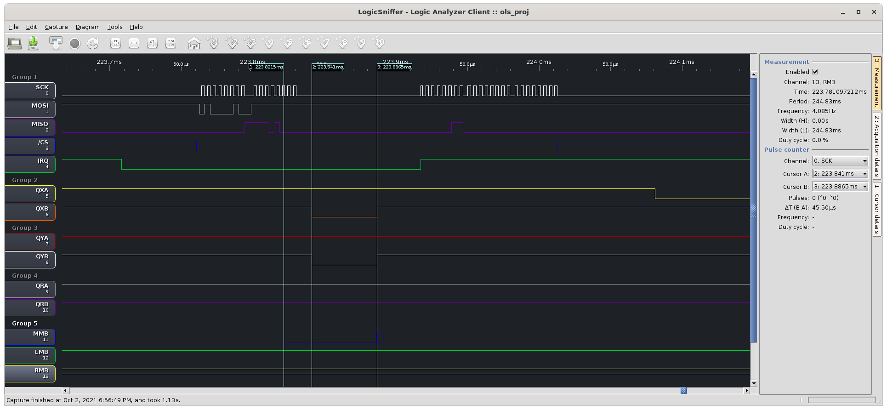

# AVAGO
ADNS-7550 laser sensor chip for quadrature output mouse

This project is based on a Dell mouse which is run by an unknown micro-controller, and SPI ADNS-7550 sensor chip. It made a very easy for me to modify it and drop in MSP430g2553 micro-chip in the same spot, after a handful of easy modifications: trace-cuts, and wire jumpers. A full schematic is missing but the pin assignment should tell whole story:

```
                                 ______________
                            Vcc  | 1       20 | GND                DB9 8
               top button   P1_0 |            | P2_6   QRA
               MOTION/IRQ   P1_1 |            | P2_7   QRB
                      CS    P1_2 |            | TEST
        DB9 5         MMB   P1_3 | 5          | RESET
                mmb-in      P1_4 |            | P1_7   MOSI
                      CLK   P1_5 |            | P1_6   MISO
   XQ   DB9 4         QXA   P2_0 |            | P2_5   5th button
    X   DB9 2         QXB   P2_1 |            | P2_4   4th button
    Y   DB9 1         QYB   P2_2 |_10______11_| P2_3   QYA      DB9 3 YQ   

mouse pinout DB9:
     QYB QXB QYA QXA
      Y   X  YQ  XQ  MMB     DB9   color   MCU
      U   D   L   R  PotY      1   red     10
   _______________________     2   blk      0
   \  1   2   3   4   5  /     3   gry     11
    \                   /      4   org      8
     \__6___7___8___9_ /       5   brw      5
       LMB  +  gnd RMB         6   grn    LMB
                   PotX        7   wht  +5vcc
                               8   blu    GND
                               9   ylw    RMB
```

Before desoldering controller chip from the original mouse, dump the calibration values that are send during boot-up. Write down what values are written to register 0x1a LASER_CFG0/1 (0x1f) and 0x1c LSRPWR_CFG0/1 (0x1d). See datasheet page 7 for details.

# Communication protocol
- at constant intervals (VerticalBlankISR), host is polling with a low level at MMB line
- controller reacts at the falling edge of MMB linkage (see marker 1 - blue line MMB)
- quadrature lines are negated with command for a brief movement (20us ... 40us) (see marker 2 - lines QXB and QYB)
- after restoring original state of quadrature lines, state of MMB is checked to verify reception
  - if MMB line is still low - treat transaction as successfully (see marker 3)


